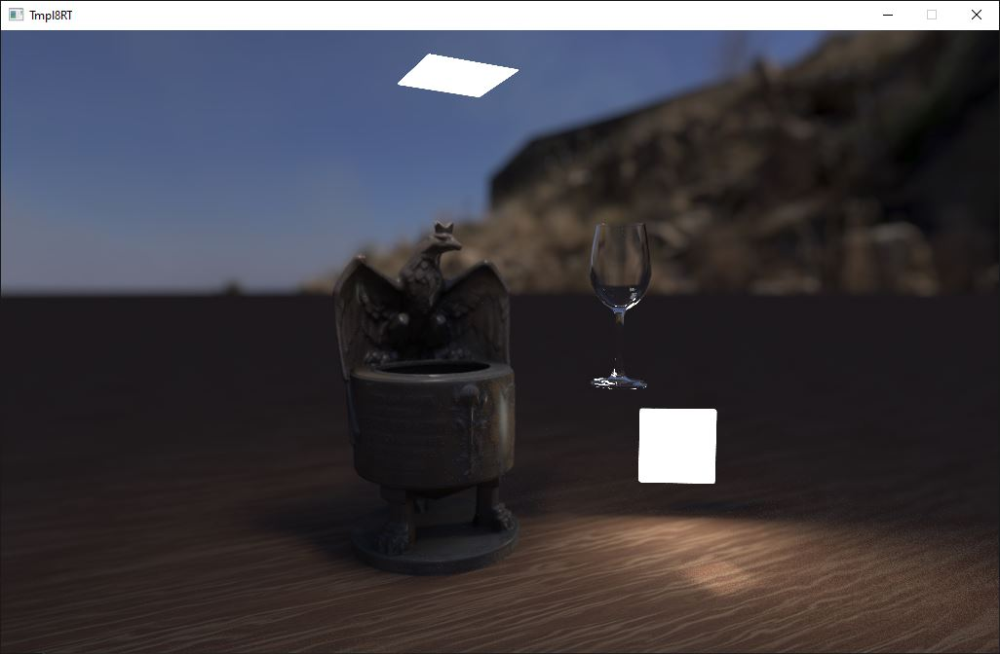
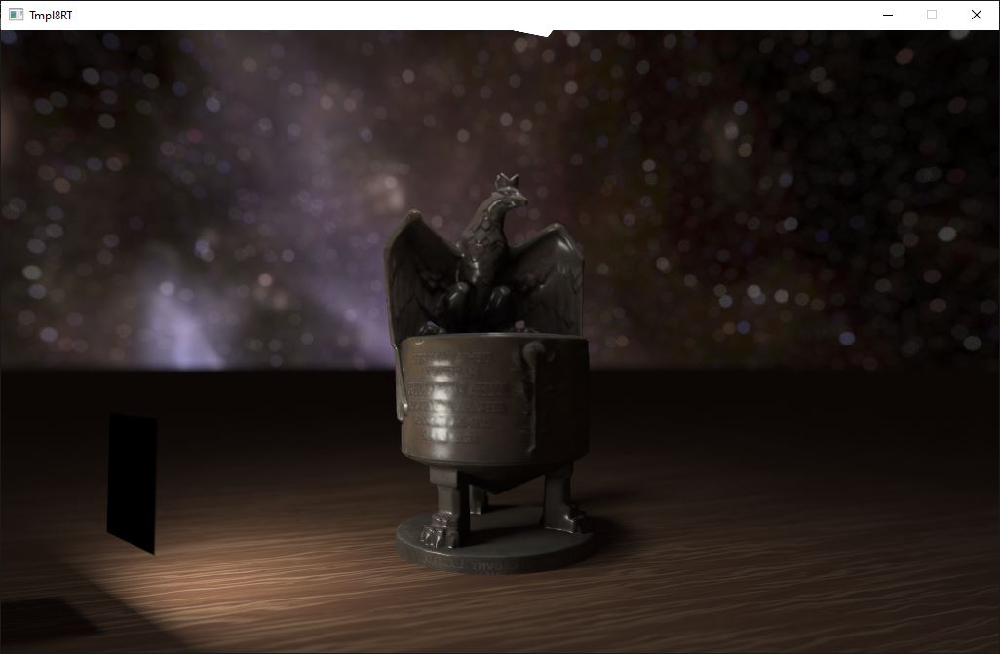
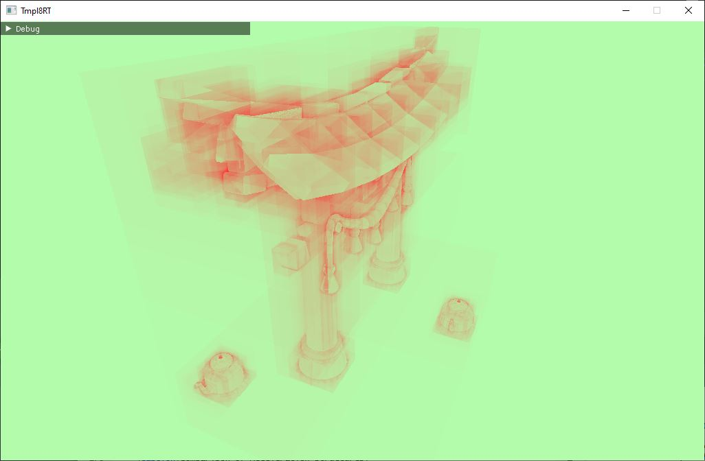

# Wavefront GPU Path Tracer


This renderer is based on a [cpu ray tracer](https://github.com/willake/cpu-ray-tracer) I made. The implementation is based on the paper [Megakernels considered harmful: wavefront path tracing on GPUs](https://dl.acm.org/doi/10.1145/2492045.2492060#sec-cit) by Samuli Laine, Tero Karras, and Timo Aila. Depends on the features enabled, the GPU version can outperform the CPU version 3x - 10x. Apart from the orignal features implemented in the template, the following feature is further developed:

**Graphics related**
-   CPU Path Tracing
-   wavefront GPU Path Tracing
-   BVH(acceleration structure)
    -   BLAS/TLAS
-   skybox
-   multiple light sources
-   reflection / refraction
-   NEE (Next Event Estimation)
-   anti-aliasing
-   microfacet BRDF
-   gamma correction
  
**Engine related**
-   .obj model loading
-   material (reflection, refraction, texture)
-   texture loading & mapping
-   scene file loading

## IDE

Visual Studio 2022

## Screenshots




## How to run

Open `tmpl_2022-rt.sln` with Visual Studio. Select a project (either CPUPathTracer or GPUPathTracer). Build.

### Inspect traversal

Toggle `Inspect Traversal` checkbox in the panel will turn into traversal debug mode.


## How to configure

### Scene

There are several scenes available in `assets` folder. In `renderer.h`, the user can set the path to the scene file and start the program. The scene will be loaded automatically.
A scene template looks like the following

```
<?xml version="1.0" encoding="UTF-8"?>
<scene>
    <!-- Scene Information -->
    <scene_name>wok scene</scene_name>
	<plane_texture_location>../assets/textures/Stylized_Wood_basecolor.tga</plane_texture_location>
    <skydome_location>../assets/harties_4k.hdr</skydome_location>
	<!-- Light List -->
    <lights>
        <!-- Light 0 -->
        <light>
	    <position>
                <x>0</x>
                <y>4.5</y>
                <z>2.0</z>
            </position>
            <rotation>
                <x>0.0</x>
                <y>0.0</y>
                <z>0.0</z>
            </rotation>
		<size>1</size>
		<color>
		   <x>24</x>
                   <y>24</y>
                   <z>22</z>
                </color>
        </light>
		<light>
                <position>
                   <x>3.3</x>
                   <y>0</y>
                   <z>2</z>
               </position>
               <rotation>
                  <x>0.0</x>
                  <y>120.0</y>
                  <z>90.0</z>
              </rotation>
                  <size>1</size>
                  <color>
                        <x>48</x>
                        <y>48</y>
                        <z>44</z>
                  </color>
        </light>
        <!-- Add more lights as needed -->
    </lights>
    <!-- Object List -->
    <objects>
        <!-- Object 1 -->
        <object>
            <mesh_idx>0</mesh_idx>
            <material_idx>0</material_idx>
            <position>
                <x>0.0</x>
                <y>1</y>
                <z>2.8</z>
            </position>
            <rotation>
                <x>-90.0</x>
                <y>0.0</y>
                <z>180.0</z>
            </rotation>
        </object>
        <object>
			<mesh_idx>2</mesh_idx>
            <material_idx>1</material_idx>
            <position>
                <x>1.5</x>
                <y>2</y>
                <z>1</z>
            </position>
            <rotation>
                <x>0</x>
                <y>0.0</y>
                <z>0.0</z>
            </rotation>
        </object>
        <!-- Add more objects as needed -->
    </objects>
	<!-- Mesh List -->
    <meshes>
        <!-- Mesh 0 -->
        <mesh>
            <model_location>../assets/urna.obj</model_location>
			<scale>
                <x>0.005</x>
                <y>0.005</y>
                <z>0.005</z>
            </scale>
        </mesh>
		<mesh>
            <model_location>../assets/sphere.obj</model_location>
			<scale>
                <x>0.5</x>
                <y>0.5</y>
                <z>0.5</z>
            </scale>
        </mesh>
        <mesh>
            <model_location>../assets/cup.obj</model_location>
			<scale>
                <x>0.2</x>
                <y>0.2</y>
                <z>0.2</z>
            </scale>
        </mesh>
        <!-- Add more objects as needed -->
    </meshes>
	<materials>
		<!-- Material 0 -->
		<material>
			<reflectivity>0.0</reflectivity>
			<refractivity>0.0</refractivity>
			<absorption>
                <x>0.0</x>
                <y>0.0</y>
                <z>0.0</z>
            </absorption>
			<roughness>0.3</roughness>
			<texture_location>../assets/textures/urna.jpg</texture_location>
		</material>
		<material>
			<reflectivity>0.0</reflectivity>
			<refractivity>1.0</refractivity>
			<absorption>
                <x>0.3</x>
                <y>0.3</y>
                <z>0.3</z>
            </absorption>
		<texture_location>../assets/textures/white.png</texture_location>
		</material>
	</materials>
</scene>
```

## Asset References
Sepcial thanks to these amazing free skyboxes and models online

[Urn for the Piłsudski Mound](https://sketchfab.com/3d-models/urn-for-the-pisudski-mound-6097301be2f143128e23d5788a11b0be)

[Torii - Japanese Gate](https://sketchfab.com/3d-models/torii-japanese-gate-32f0cae137064c4da4c8136bc0ff2f2d)

[Wok](https://sketchfab.com/3d-models/wok-3b9d2c1e35884be3909a144d93dda6a0)

[Painting by Stanisław Ignacy Witkiewicz](https://sketchfab.com/3d-models/painting-by-stanisaw-ignacy-witkiewicz-db75039f5eef44b5a865af7f41677758)

[Hollow Knight](https://sketchfab.com/3d-models/hollow-knight-5a76d93e39984f829abd6f406562265b)

[Game Table](https://sketchfab.com/3d-models/game-table-a1c2dabcff0f4463a81fb4543a79e4bc)

[Studio Room](https://sketchfab.com/3d-models/studio-room-c02efe2e7a10404895c2b49e3ca1d11a)

[Path At The Hill During Sunny Day](https://hdri-haven.com/hdri/path-at-the-hill-during-sunny-day#google_vignette)

[Milky Way Skybox HDRI panorama](https://sketchfab.com/3d-models/milky-way-skybox-hdri-panorama-b57711d6a450410ca612c4a36f08ce21)

[Sky Pano - Milkyway](https://sketchfab.com/3d-models/sky-pano-milkyway-0016725c047a4ea18cd0b5e5ef2fe441)

[Wooden Stylised Carriage](https://sketchfab.com/3d-models/wooden-stylised-carriage-ccac9ded5666488c9355d2ed3575fae9)
