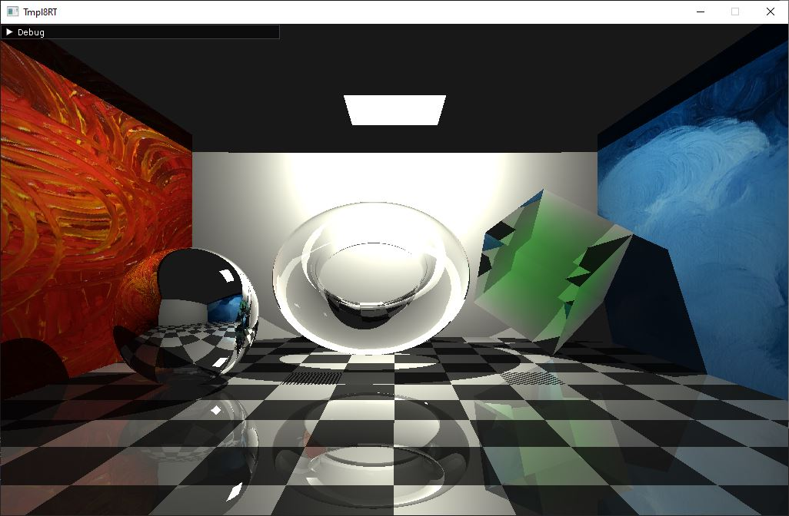
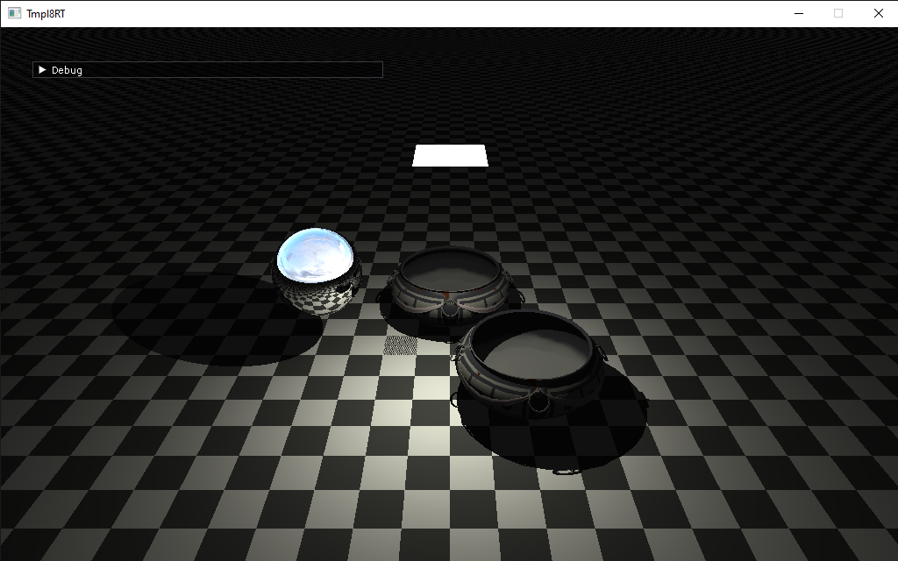
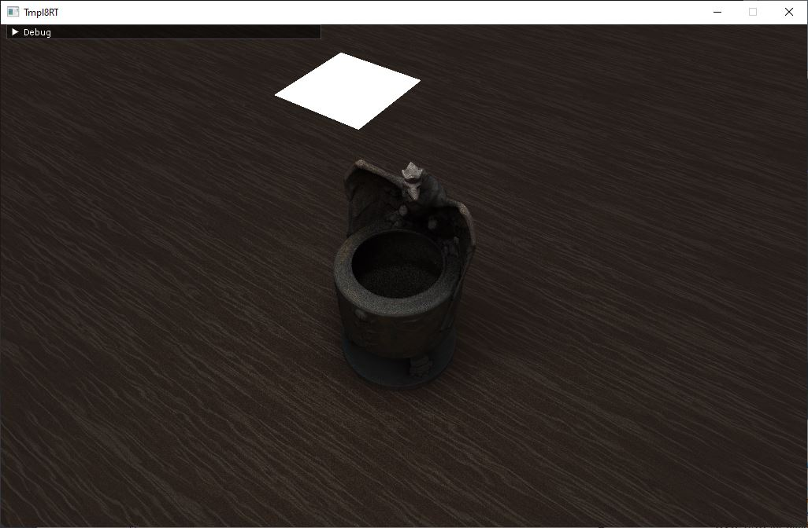
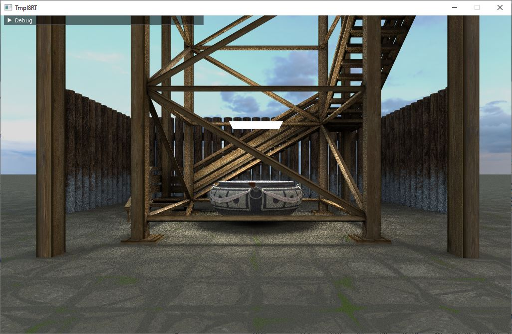
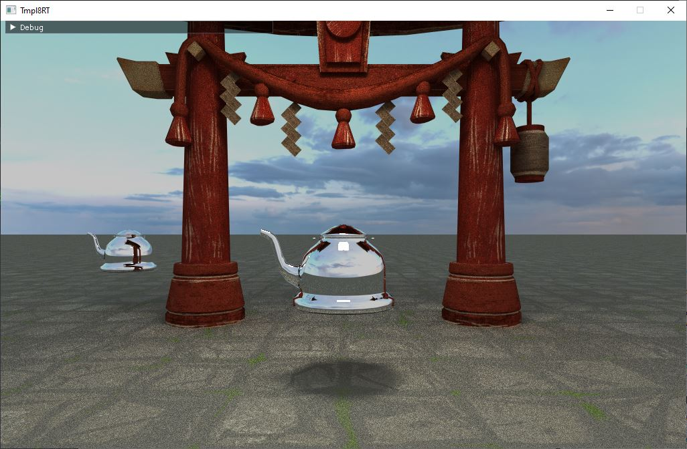
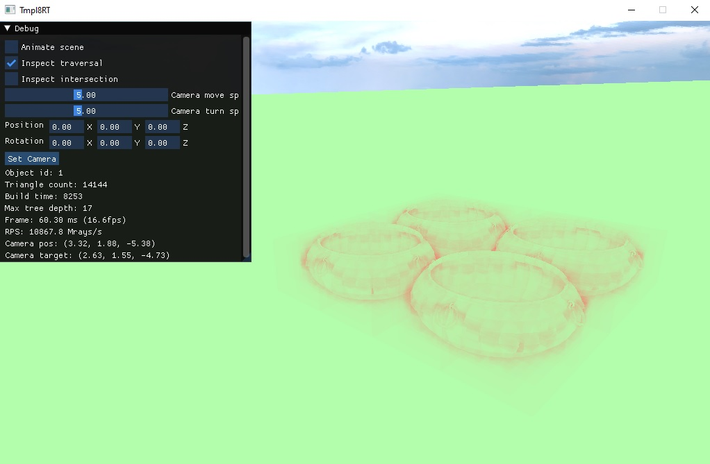

# Hui Renderer

This renderer is based on the [template project](https://github.com/jbikker/tmpl8rt_UU) of [Dr. Jacco Bikker](https://github.com/jbikker). By extending the template, the following features are developed:

- Whitted Style ray tracer
- Path tracer
- acceleration structures
  - BVH (with SAH)
  - Grid
  - KDTree
  - TLAS
- .obj model loading
- material
- texture loading & mapping
- skybox
- instruments (only available for whitted style ray tracer)
- scene file loading

## IDE
Visual Studio 2022

## Whitted Style Ray Tracer



## Path Tracer




## How to run
Open `tmpl_2022-rt.sln` with Visual Studio. Select a project (either WhittedStyle or PathTracer). Build.
### Inspect traversal
Toggle `Inspect Traversal` checkbox in the panel will turn into traversal debug mode.



## How to configure

### Aceleration struture
There are several acceleration structure available. To support both pure acceleration structure and top level assceleration strcture, there are two type of scene. To switch between different scenes, in `renderer.h`, replace the scene class to either `TLASFileScene` or `FileScene`. 

The first one is `FileScene` class, which supports adding all triangles into a single acceleration structure. In `file_scene.h`, there are three definitions: `USE_BVH`, `USE_Grid`, and `USE_KDTree`. Uncomment one of them, then the `FileScene` class will load the scene in certain acceleration structure.

The second is `TLASFileScene` class, which supports each model as an acceleation structure. A top-level acceleration structures will includes all of them. In `tlas_fil_scene.h`, there are three definitions: `TLAS_USE_BVH`, `TLAS_USE_Grid`, and `TLAS_USE_KDTree`. Uncomment one of them, then the `FileScene` class will load the scene in certain acceleration structure.

For configuring BVH, in `bvh.h` or `tlas_bvh.h`, there is a definition called `SAH`. Uncomment it will enable SAH for finding spliting planes for BVH. 

### Scene
There are several scenes available in `assets` folder. In `renderer.h`, the user can set the path to the scene file and start the program. The scene will be loaded automatically.
A scene template looks like the following
```
<?xml version="1.0" encoding="UTF-8"?>
<scene>
    <!-- Scene Information -->
    <scene_name>wok scene</scene_name>
	<light_position>
		<x>0.0</x>
		<y>3.0</y>
		<z>2.0</z>
	</light_position>
    <skydome_location>../assets/industrial_sunset_puresky_4k.hdr</skydome_location>

    <!-- Object List -->
    <objects>
        <!-- Object 1 -->
        <object>
            <model_location>../assets/wok.obj</model_location>
            <material_idx>0</material_idx>
            <position>
                <x>-1.0</x>
                <y>-0.5</y>
                <z>-1.0</z>
            </position>
            <rotation>
                <x>0.0</x>
                <y>0.0</y>
                <z>0.0</z>
            </rotation>
            <scale>
                <x>0.5</x>
                <y>0.5</y>
                <z>0.5</z>
            </scale>
        </object>

        <!-- Add more objects as needed -->
    </objects>
    <materials>
		<!-- Material 0 -->
		<material>
			<reflectivity>1.0</reflectivity>
			<refractivity>0.0</refractivity>
			<absorption>
                <x>0.0</x>
                <y>0.0</y>
                <z>0.0</z>
            </absorption>
			<texture_location></texture_location>
		</material>
		<material>
			<reflectivity>0.0</reflectivity>
			<refractivity>0.0</refractivity>
			<absorption>
                <x>0.0</x>
                <y>0.0</y>
                <z>0.0</z>
            </absorption>
			<texture_location>../assets/textures/T_Trim_01_BaseColor.png</texture_location>
		</material>
	</materials>
</scene>
```

## Original README.md from template

This template is intended for students of Utrecht University.

**Please refer to "\_ getting started.pdf" for instructions.**

Code is fully public domain. Use as you please.

Contact me at bikker.j@gmail.com.
